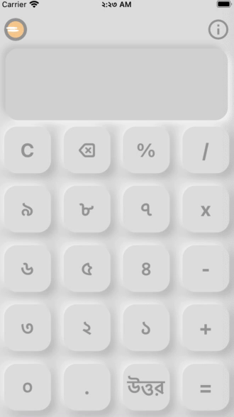
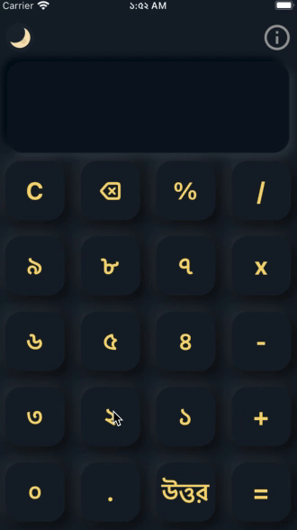

# Bengali Calculator
</img>
Neomorphic design Bengali calculator will be on the app store before 21st February, in celebration of International Mother Language Day

## Screenshots

<table align="center" style="margin: 0px auto;">
  <tr>
    <th>Light Mode</th>
    <th>Dark Mode</th>
  </tr>
  <tr>
    <td></img></td>
    <td></img></td>
  </tr>
  </table>
