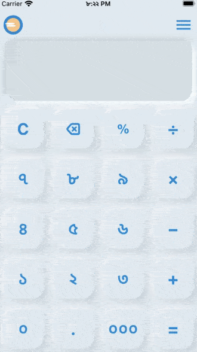
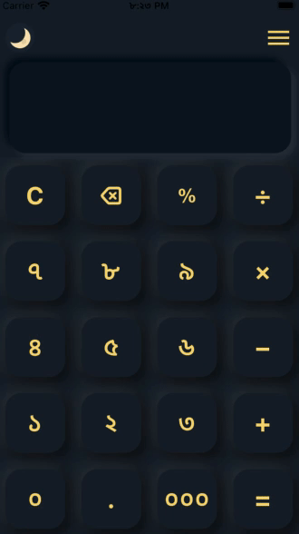

&nbsp;&nbsp;
&nbsp;&nbsp;
<a href="https://choosealicense.com/licenses/mit/" target="_blank"></a>&nbsp;&nbsp;
&nbsp;&nbsp;


# Bengali Numeric (BN) Calculator

</img>

<p align="justify" >
    Bengali Numeric Calculator, in short, BN Calculator is designed with a custom <a href="lib/src/widget/button_widget.dart">neumorphic button</a> class, with a custom button press sound, that imitates the sound of a physical calculator. In addition to that, it has a beautiful dark theme, and a user can turn On/Off the dark theme using a custom animated button on the AppBar.
</p>

Note: It's an open-source project; hence anyone can use this code according to the [MIT License](https://choosealicense.com/licenses/mit/) rules & regulations.

## Third-Party Packages:

1. For state-management: [provider: ^6.0.2](https://pub.dev/packages/provider)
2. For modern neumorphic containers: [clay_containers: ^0.3.2](https://pub.dev/packages/clay_containers)
3. For animated switch to activate dark/light mode: [day_night_switcher: ^0.2.0+1](https://pub.dev/packages/day_night_switcher)
4. For playing 'button click' sound: [audioplayers: ^0.20.1](https://pub.dev/packages/audioplayers)
5. For executing mathematical operations: [math_expressions: ^2.3.0](https://pub.dev/packages/math_expressions)
6. For number formatting: [intl: ^0.17.0](https://pub.dev/packages/intl)

   \*\*Thanks to those developers for their awesome packages.\*\*

<!-- ## APK File -->

## Screenshots

<table align="center" style="margin: 0px auto;">
  <tr>
    <th>Light Mode</th>
    <th>Dark Mode</th>
  </tr>
  <tr>
    <td></img></td>
    <td></img></td>
  </tr>
  </table>

## File Pattern Inside The lib Folder

```
lib/
├── app/
│   ├── provider/
│   │   ├── history_provider.dart
│   │   ├── sound_provider.dart
│   │   └── theme_provider.dart
│   ├── view/
│   │   ├── calculator.dart
│   │   └── history.dart
│   └── widget/
│       ├── util/
│       │   └── arrow_clipper.dart
│       ├── button_widget.dart
│       ├── dropdown_menu.dart
│       └── top_appbar.dart
└── main.dart
```
